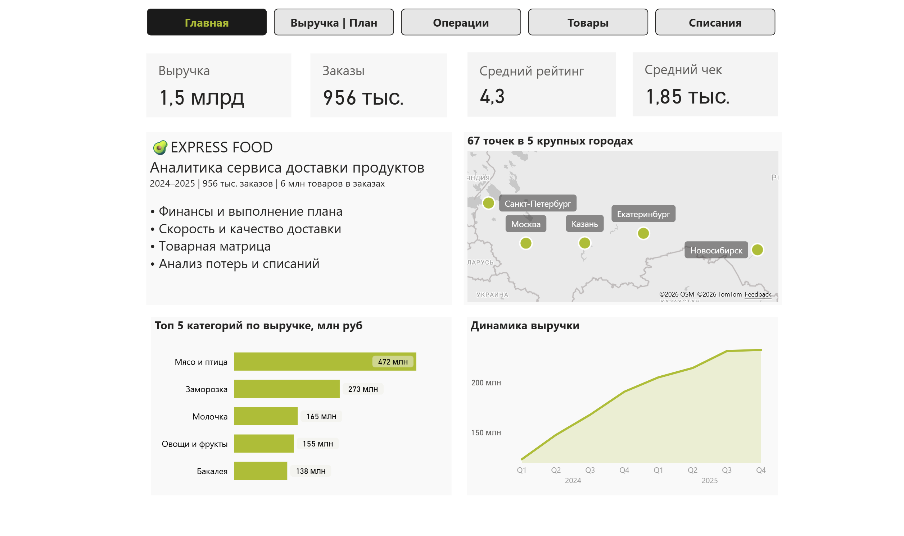
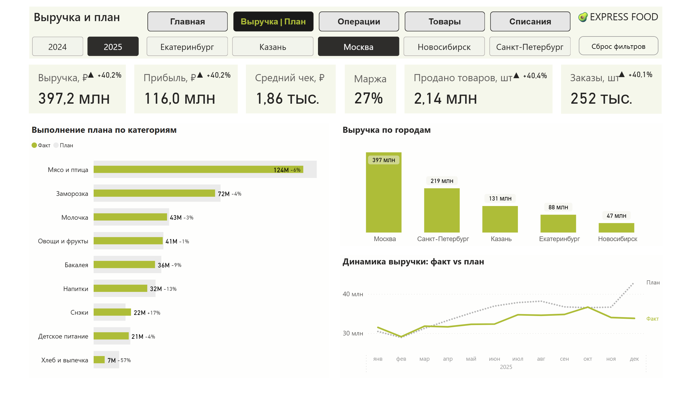
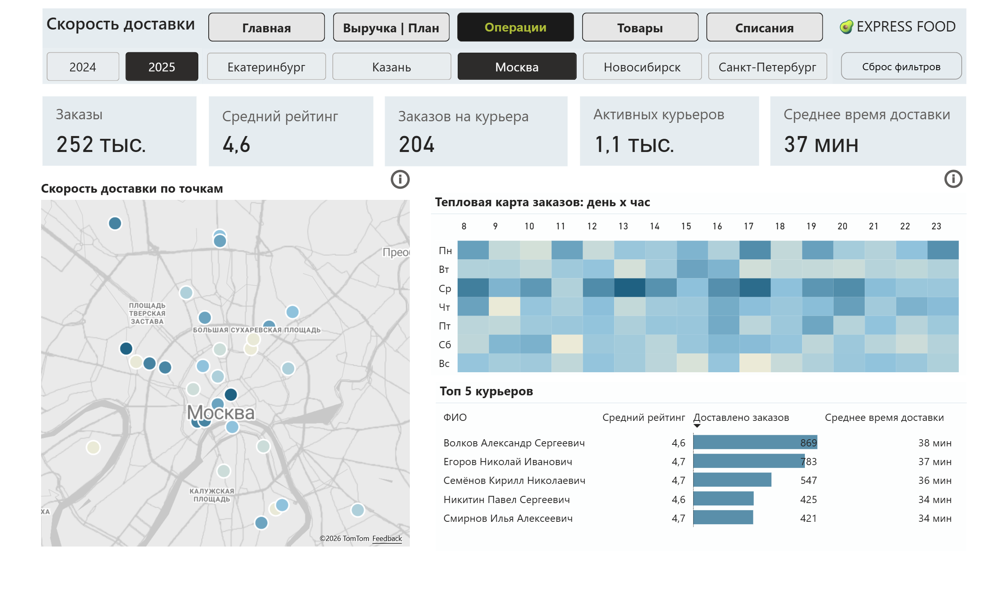
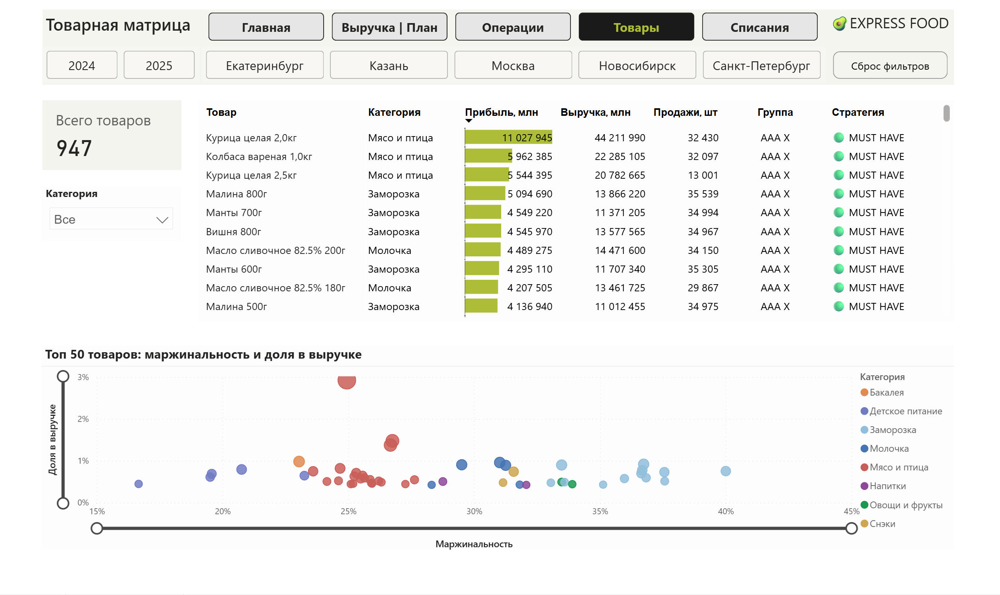
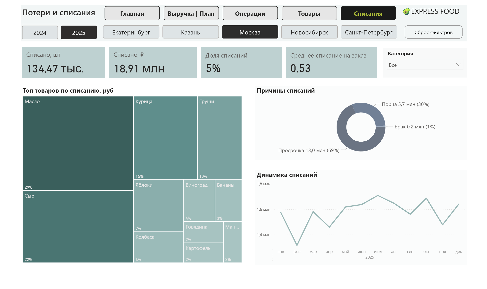

# 📊 Аналитика сервиса доставки продуктов

> Интерактивный дашборд для руководителя e-commerce бизнеса.
> Анализ продаж, маржинальности и ассортимента за период **2024–2025 гг.**



---

## О проекте

### Бизнес-контекст
> Дашборд разработан для анализа эффективности сервиса доставки продуктов питания. 
> Помогает руководству отслеживать ключевые метрики бизнеса: выручку, выполнение плана, 
> скорость доставки и качество обслуживания клиентов в 5 крупных городах России.

### Функционал дашборда

- **5 страниц аналитики**: Главная, Выручка/План, Операции, Товары, Списания
- **Сквозные фильтры**: год, город, категория товаров
- **Сложные меры DAX**: YoY-рост, топ курьеров, ABC-XYZ-сегментация

---

##  Данные

| Параметр | Значение |
|----------|----------|
| Тип данных | Синтетические (сгенерированы через Python) |
| Период | Январь 2024 — декабрь 2025 |
| Объём | ~1 млн строк заказов, ~1000 товаров |
| География | 5 городов, 67 дарксторов |
| Курьеры | ~2250 активных  |
| Таблицы | 7 связанных таблиц в модели данных |

>  **Почему синтетика?**  Полный контроль над структурой и качеством данных + возможность смоделировать любые бизнес-сценарии для демонстрации функционала.
---

## Демонстрация

### Главная страница

> **Сводный обзор бизнеса.** Ключевые KPI компании (выручка, заказы, рейтинг, средний чек), география присутствия по городам, динамика продаж и топ категорий товаров.

### Выручка и План

> **Финансовые показатели и выполнение целей.** Детальный анализ выручки, прибыли, маржи и среднего чека. Сравнение плановых и фактических значений, динамика по периодам и распределение выручки по городам.

### Операции и Доставка

> **Эффективность логистики и работы курьеров.** Метрики скорости доставки, нагрузка на курьеров, рейтинг качества, тепловая карта заказов и анализ производительности по дарксторам.

### Товарная Матрица

> **Анализ ассортимента и прибыльности товаров.** ABC-XYZ сегментация, маржинальность и вклад товаров в общую выручку. Стратегические рекомендации по управлению товарной матрицей (топ-50 SKU).

### Потери и Списания

> **Контроль потерь и утилизации.** Объём и стоимость списаний, доля в заказах, структура потерь по категориям и товарам. Анализ причин списаний для выявления проблемных зон.

> **Интерактивность:** Все визуализации связаны сквозными фильтрами. Выбор значения на одном графике автоматически фильтрует остальные.

---

## Ключевые DAX-меры

### 1. ABC-анализ (пример по выручке)

```dax
ABC выручка = 
VAR CurrentRevenue = [Выручка]
VAR TotalRevenue = CALCULATE([Выручка], ALLSELECTED('products'))
VAR CumulativeRevenue = CALCULATE([Выручка], FILTER(ALLSELECTED('products'), [Выручка] >= CurrentRevenue))
VAR CumulativePercent = CumulativeRevenue / TotalRevenue
RETURN SWITCH(TRUE(), CumulativePercent <= 0.7, "A", CumulativePercent <= 0.9, "B", "C")
```

### 2. XYZ-анализ (стабильность спроса)

```dax
XYZ_мера = 
VAR CurrentProduct = SELECTEDVALUE('products'[product_id])
VAR SalesByMonth = SUMMARIZE(FILTER('order_items', 'order_items'[product_id] = CurrentProduct), 'Календарь'[Год], 'Календарь'[Месяц_номер], "Qty", SUM('order_items'[quantity]))
VAR AvgSales = AVERAGEX(SalesByMonth, [Qty])
VAR StdDevSales = STDEVX.P(SalesByMonth, [Qty])
VAR CoefVar = DIVIDE(StdDevSales, AvgSales)
RETURN SWITCH(TRUE(), CoefVar < 0.1, "X", CoefVar < 0.25, "Y", "Z")
```

### 3. Динамика выручки с индикаторами (YoY)

```dax
Динамика_выручки = 
VAR CurrentVal = [Выручка]
VAR PastVal = CALCULATE([Выручка], SAMEPERIODLASTYEAR('Календарь'[Date]))
VAR DiffPct = DIVIDE(CurrentVal - PastVal, PastVal)
VAR Icon = SWITCH(TRUE(), DiffPct > 0.01, "▲ ", DiffPct < -0.01, "▼ ", "● ")
RETURN IF(NOT ISBLANK(PastVal) && NOT ISBLANK(CurrentVal), Icon & FORMAT(DiffPct, "+0.0%;-0.0%;0.0%"), BLANK())
```

---

## Как открыть проект

1. Установите [Power BI Desktop](https://powerbi.microsoft.com/desktop/) 
2. Скачайте файл `dashboard_express.pbix`
3. Откройте файл — **данные уже встроены**, дашборд отобразится сразу
4. Используйте фильтры в верхней панели для взаимодействия с визуализациями

> **Примечание:** При нажатии кнопки «Обновить» может потребоваться указать пути к исходным CSV-файлам. Для просмотра и анализа текущих данных это не требуется.

---

## Автор

**@dimavl22 (tg)**  

---


